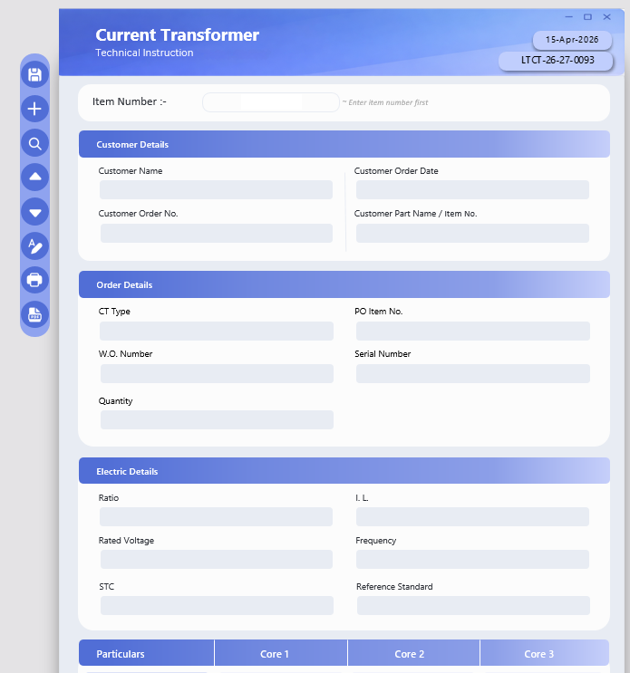
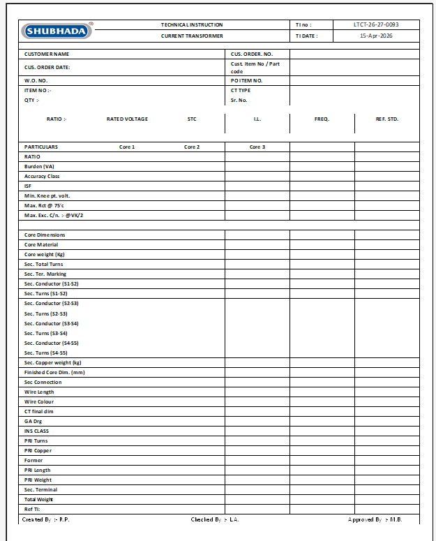

# Smart Excel TI Management System
### A full-featured desktop ERP application built inside Microsoft Excel using VBA + ActiveX

> **Built for Shubhada Polymers Products Pvt. Ltd.** — a real manufacturing company  
> **Status:** Live in production · Used daily by the operations team

---

## The Problem It Solved

Every time the production team received a customer Purchase Order, someone had to manually:
- Create a **new Excel tab** for each Technical Instruction (TI)
- Copy-paste customer and item details from scratch — even for repeat orders
- Navigate through dozens of messy tabs to find old TIs
- Hope no one made a typo, because there was **zero validation**

The result: hours of wasted time, inconsistent data, copy-paste errors, and zero searchability across hundreds of TIs.

---

## What I Built

A complete **desktop application inside Excel** — no external software, no installation, no database server. The production team opens one `.xlsm` file and gets a fully functional ERP module.


*The clean data entry interface — Current Transformer Technical Instruction form*


*What gets printed — exact original Shubhada format with logo, fields, core table, signatures*

---

## Feature Overview

### A · Transaction Management
- Save new TI, Edit existing TI
- Unique TI number validation — no duplicates ever generated
- Auto ID generation for every Header record and Line record

### B · Relational Data Model (Header–Line Architecture)
- **Header table** — TI number, customer name, order date, item details
- **Lines table** — Core-wise particulars (Core 1, Core 2, Core 3) stored as structured rows
- Real database thinking implemented entirely in Excel named ranges and sheets

### C · Dynamic Core Grid System
- Reads the grid dynamically at runtime — finds `PARTICULARS` column and `Core 1/2/3` headers automatically
- Converts the grid layout → structured DB rows on save
- Reconstructs DB rows → grid layout on load
- Handles flexible labels, merged cells, and variable column positions

### D · Search + Navigation
- Search any TI by TI number (instant lookup)
- Navigate: First / Previous / Next / Last transaction
- Filter: view only today's transactions

### E · Auto-Prefill System
- Enter an item number → all associated header fields and core grid data prefill automatically
- If item not found in master → prompts user to create it via UserForm
- Eliminates copy-paste for repeat orders entirely

### F · Item Master (UserForm)
- Dedicated UserForm to Add or Edit items
- Core-wise data entry with validation (at least one core required)
- Multi-core save logic handles up to 3 cores per item

### G · Dual-Sync Print System
- User always works in the **clean data entry UI** (ActiveX text boxes)
- Every field syncs in real time to a **hidden structured sheet** that holds the exact original print format
- Click Print → the hidden sheet renders and prints the original Shubhada TI format — logo, layout, signature lines, everything
- No reformatting. No copy-paste. One click.

### H · Application Infrastructure
- Form lock/unlock protection (prevents accidental edits)
- Auto-save after every transaction
- Auto-backup to a timestamped copy
- Form reset / new transaction workflow
- Global state management (`CurrentHeaderID`, `IsEditMode`, `CurrentTINumber`)

---

## Architecture

```
CT_TI_DATA_ENTRY.xlsm
│
├── Sheets
│   ├── Sheet1 (Form)              ← The UI — what users see and interact with
│   ├── Sheet2 (DB)                ← Internal data store
│   ├── Sheet3 (Transactions_Header) ← Header table: one row per TI
│   ├── Sheet4 (Transactions_Lines)  ← Lines table: core-wise rows per TI
│   ├── Sheet5 (Data_Entry)        ← Hidden print-ready format sheet
│   └── Sheet6 (Settings)          ← Config, column mappings, TI counter
│
└── Modules (16 VBA modules)
    ├── mod_ConfigAndHelpers       ← Constants, sheet references, shared helpers
    ├── mod_CoreGrid               ← Dynamic grid read/write engine
    ├── mod_FormActions            ← Save, Edit, New, Reset logic
    ├── mod_Navigation             ← First/Last/Next/Prev/Search navigation
    ├── mod_pdf                    ← PDF export logic
    ├── mod_Prefill                ← Item number lookup + auto-fill
    ├── mod_print                  ← Print routing to hidden sheet
    ├── mod_search                 ← TI number search
    ├── mod_state                  ← Global state variables
    ├── mod_TI_number              ← TI number generation + validation
    ├── mod_TransactionLoader      ← Load TI data from DB into form
    ├── mod_Transactions           ← Save/update Header + Lines tables
    ├── mod_UIUX                   ← UI state control (lock/unlock, button states)
    ├── modbackup                  ← Auto-backup logic
    └── modClick_Handler           ← Centralised click event routing
```

---

## Business Impact

| Before | After |
|---|---|
| New tab manually created per TI | Single form for all TIs |
| Copy-paste for repeat item codes | Auto-prefill from item master |
| No search — scroll through tabs | Instant search by TI number |
| No validation — duplicate TIs possible | Unique TI number enforced |
| Error-prone manual data entry | Structured, validated data model |
| Inconsistent print formats | One-click exact-format print |

**Result:** Estimated 60%+ reduction in TI creation time. Zero duplicate TI incidents since deployment.

---

## Tech Stack

| Layer | Technology |
|---|---|
| Application layer | Microsoft Excel VBA |
| UI controls | ActiveX TextBox, ComboBox, CommandButton, Label |
| UI embedding | UserForms (Item Master) |
| Data model | Named Ranges + structured sheet tables (Header-Line relational model) |
| Print engine | Hidden sheet dual-sync architecture |
| Dynamic parsing | Runtime column discovery via cell scanning |

---

## What's in This Repo

```
/
├── README.md                  ← This file
├── screenshots/
│   ├── ui_form.png            ← Data entry UI
│   └── print_output.png       ← Print output format
└── code_snippets/
    ├── mod_CoreGrid.bas       ← Dynamic grid engine (key module)
    ├── mod_Prefill.bas        ← Auto-prefill logic
    ├── mod_Navigation.bas     ← Navigation system
    └── mod_TransactionLoader.bas ← DB → Form loader
```

> **Note:** The full `.xlsm` file is not shared publicly as it contains proprietary company data and formats. Key architectural modules are shared as `.bas` exports to demonstrate the engineering approach.

---

## Key Engineering Decisions

**Why Excel, not a proper database app?**  
The production team uses Excel daily. Zero-installation, zero-training, zero IT dependency. The right tool for the environment — not the theoretically "best" tool.

**Why a Header-Line relational model in Excel?**  
Each TI can have up to 3 cores, each with 35+ parameters. A flat row structure would create 100+ columns. The Header-Line split keeps data normalised, queryable, and extensible.

**Why dynamic grid reading instead of fixed column references?**  
The TI format has evolved over time and may change. Hardcoding column positions would break on any layout change. The dynamic reader finds headers at runtime — making the system resilient to future format changes.

---

## About the Developer

**Piyush Kothawade** — Data Analyst & AI Automation Specialist  
Building AI-powered automation systems for manufacturing operations at Shubhada Polymers.

- Portfolio: [codebasics.io/portfolio/PiyushKothawade](https://codebasics.io/portfolio/PiyushKothawade)
- LinkedIn: [linkedin.com/in/piyushkothawade](https://linkedin.com/in/piyushkothawade)

*Other live projects: OEE Production Web Dashboard · XML-to-PDF Batch Automation · Python ERP RPA*

---

*Built with zero budget, one laptop, and the conviction that the right system beats the best software.*
